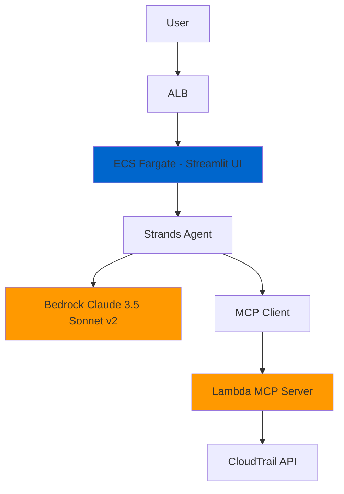

# 🕵️‍♂️ AWS Detective Agent

AI-powered AWS analysis system using **Strands Agents**, **MCP**, and **Claude 3.5 Sonnet v2**.

## 🏗️ Architecture



## ✨ Features

- **Strands Agents** + **Claude 3.5 Sonnet v2**
- **MCP Server** on AWS Lambda
- **Streamlit** UI on ECS Fargate
- **CloudTrail** event analysis

## 🚀 Technology Stack

### Backend & AI
- **Python 3.12**
- **Strands Agents**
- **FastMCP**
- **Amazon Bedrock**
- **AWS Lambda**

### Frontend
- **Streamlit**

### Infrastructure
- **AWS CDK (TypeScript)**
- **Docker**
- **AWS ECS Fargate**
- **AWS ECR**
- **AWS ALB**

### AWS Services
- **CloudTrail**
- **VPC**
- **IAM**
- **CloudWatch**

## 📁 Project Structure

```
aws-detective-agent/
├── app/                     # Streamlit Application
│   ├── main.py             # Main Streamlit app with Strands Agent
│   ├── requirements.txt    # Python dependencies
│   ├── Dockerfile         # Container configuration
│   └── deploy.sh          # Deployment script
├── lambda/                 # MCP Server
│   ├── cloudtrail_mcp/    # CloudTrail MCP implementation
│   │   └── main.py        # FastMCP server with CloudTrail integration
│   ├── Dockerfile         # Lambda container config
│   └── pyproject.toml     # Python project configuration
├── lib/                   # CDK Infrastructure
│   ├── config.ts          # Configuration management
│   └── stack.ts           # Unified CDK stack definition
├── bin/
│   └── app.ts             # CDK application entry point
└── cdk.json               # CDK configuration
```

## 🚀 Quick Start

```bash
# Install dependencies
npm install

# Configure environment
cp env.example .env
# Edit .env: Set AWS_ACCOUNT_ID and HOME_IP_ADDRESS

# Deploy
./app/deploy.sh
```

## 🧹 Cleanup

```bash
npm run destroy
```
