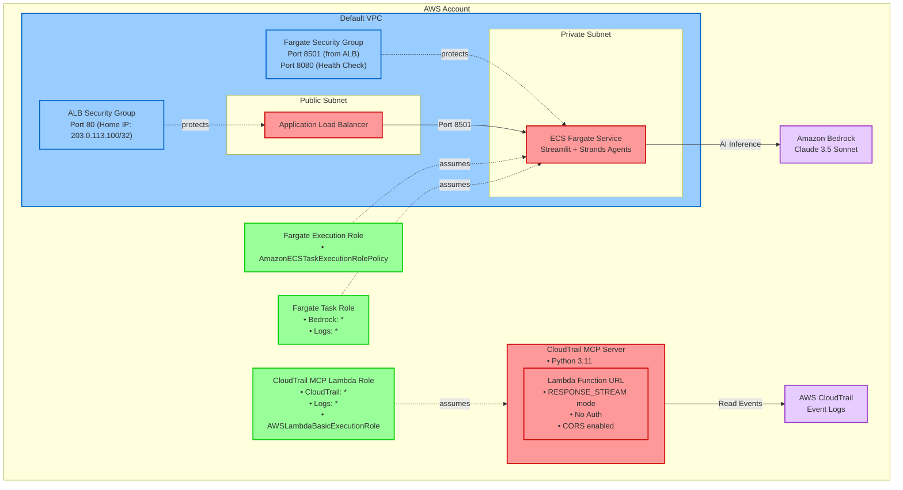

# CloudTrail Behavior Prediction - システム構成図

このドキュメントは、CloudTrail行動予測プロジェクトのAWS CDKによるシステム構成を視覚化したものです。

## システム構成図



## 構成要素の説明

### 🏗️ InfrastructureStack（青色）
- **Default VPC**: 既存のデフォルトVPCを使用（検証環境向け）
  - **ALB Security Group**: 自宅IP（203.0.113.100/32）からのHTTP(80)のみ許可
  - **Fargate Security Group**: ALBからのStreamlit(8501)とヘルスチェック(8080)のみ許可

### 🚀 ApplicationStack（赤色）
- **Public Subnet**
  - **Application Load Balancer**: 自宅IP限定アクセス
- **Private Subnet**
  - **ECS Fargate Service**: Streamlit + Strands Agents
- **CloudTrail MCP Server**: Python 3.11のLambda関数（256MB、15分タイムアウト）
  - **Function URL**: ストリーミングモード対応でCORS設定済み

### 🔐 IAMStack（緑色）
- **CloudTrail MCP Lambda Role**: CloudTrailの全権限とログ出力権限
- **Fargate Execution Role**: ECSタスク実行用の標準権限  
- **Fargate Task Role**: Bedrock AIサービスへのアクセス権限

### 🌐 AWS Managed Services（紫色）
- **Amazon Bedrock**: Claude 3.5 Sonnet for AI inference
- **AWS CloudTrail**: イベントログデータソース

## 包含関係

- **VPC** の中に **Security Groups** が含まれる
- **Lambda関数** の中に **Function URL** が含まれる
- **IAM Roles** は各リソースに適用される
- **AWS Managed Services** は独立したサービス

## 現在の実装状況

⚠️ **注意**: 現在の構成では以下の点に注意が必要です：

- **ALB（Application Load Balancer）は未実装**：Security Groupは準備されているが、ALB自体は作成されていない
- **ECS Fargate Service は未実装**：TODOの状態で、実際のStreamlitアプリケーションはまだデプロイされていない
- **現在動作しているのはLambda Function URLのみ**：CloudTrail MCP Serverとして機能

### 想定されるアクセスフロー（将来）
```
自宅IP → ALB (80番ポート) → ECS Fargate (8501番ポート Streamlit)
```

### 現在のアクセスフロー
```
インターネット → Lambda Function URL → CloudTrail MCP Server
```

## デプロイ順序

1. **IAMStack**: 各種IAMロールを作成
2. **InfrastructureStack**: VPCとセキュリティグループを構成
3. **ApplicationStack**: Lambda関数とECSサービスをデプロイ

## セキュリティ考慮事項

- 自宅IPからのアクセスのみ許可
- IAMロールによる最小権限の原則
- CloudTrailデータへの適切なアクセス制御 